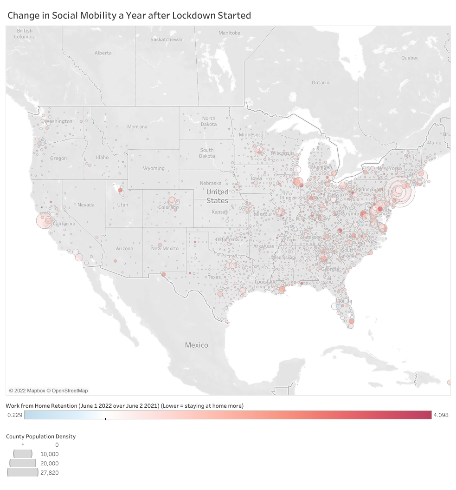

# Business MVP
## Helping Costco Tap Into the Work-From-Home Market
##### Josh Wang
##### Mar 13 2022

---
### MVP Overview
**Goal**:
The Work-From-Home (WFH) trend is likely here to stay with many implications that may affect Costco's sales. Here I look at where in the US the WFH trend persists and make suggestions on Costco's business decisions.

**Process**:
Social Mobility data from: https://covid19.apple.com/mobility

US County Population Density Data from: https://covid19.census.gov/datasets/USCensus::average-household-size-and-population-density-county/

Costco Store Location Data scraped from (not visualized in this MVP): https://www.costco.com/WarehouseListByStateDisplayView

**Preliminary visualization**:

Figure 1. Tableau Dashboard of Social Mobility Change in the United States by County. [Interactive link here](https://public.tableau.com/views/Applymobility_popdensity/Dashboard1?:language=en-US&publish=yes&:display_count=n&:origin=viz_share_link).

**Preliminary conclusions**:

Looking at Figure 1, counties with lower mobility (bluer color) and higher population density (bigger circle) are potential candidates for new Costco Warehouse locations.